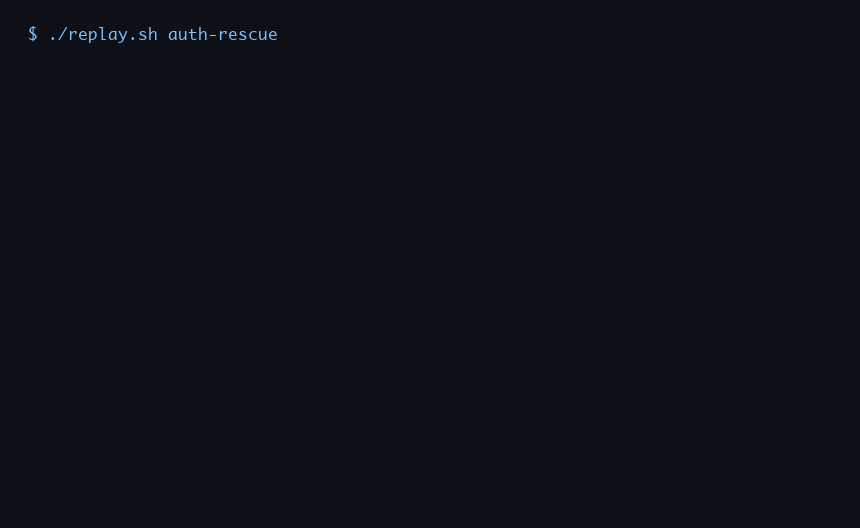

# 🛸 Orbit

> **Mission control for AI coding agents.**

Orbit is the harness your coding agent actually needs — structured loops, real validation gates, rubric-based evaluation, checkpoint resumability, and a full audit trail. Define the mission. Orbit lands it.

<p align="center">
  
</p>

<p align="center">
  <em>↑ Orbit detects a failing test, selects the right task, runs the agent, validates the fix, and marks the orbit complete — no hand-holding required.</em>
</p>

---

## The problem with AI coding agents

They drift. They hallucinate changes. They skip validation. They leave no record of what they did or why. You give them a task and cross your fingers.

```
You:   "Fix the auth bug."
Agent: ✅ Done!
You:   "Did you run the tests?"
Agent: ✅ All passing!
You:   *runs tests* ❌❌❌
```

Sound familiar?

---

## Orbit fixes that

Every agent run becomes a structured **orbit** — a bounded, validated, auditable loop. If the agent can't prove its work, the orbit doesn't close.

<p align="center">
  
</p>

<p align="center">
  <em>↑ The Orbit loop: task selection → agent execution → validation gate → rubric evaluation → review → next orbit.</em>
</p>

**What you get:**

- 🎯 **Mission files** — human-owned goal, scope, constraints, definition of done
- 📋 **Dependency-aware task queue** — priority-sorted, one task per orbit, respects your DAG
- 🚦 **Validation gate** — real `pytest`/lint/typecheck runs; nothing advances without evidence
- 📐 **Rubric evaluator** — structured scoring on task focus, completion, change signal, and validation
- 🔁 **Retry policy** — auto-retry on failure or validation miss, configurable limits
- 💾 **Checkpoint resumability** — durable state; pick up mid-mission without losing progress
- 💰 **Budget management** — cap runs, failure count, and estimated cost per session
- 📡 **Full telemetry** — every orbit writes `agent-result.json`, `evaluation.json`, `review.json`, and a timestamped progress log

---

## Works with any agent

Orbit is adapter-based. Swap in whatever coding agent you have:

| Adapter | Agent |
|---|---|
| `adapters.claude_cli:ClaudeCliAdapter` | Claude Code (`claude --print`) |
| `adapters.codex_cli:CodexCliAdapter` | OpenAI Codex CLI |
| `adapters.cursor_cli:CursorCliAdapter` | Cursor |
| `adapters.cli_json:CliJsonAdapter` | Any agent that reads stdin and writes JSON |
| `adapters.mock:MockAgentAdapter` | Local testing / dry runs |

---

## What can you do with Orbit?

| Use case | How Orbit helps |
|---|---|
| **Nightly bug triage** | Point Orbit at your failing CI jobs. It selects the highest-priority fix, validates the patch, and leaves a full artifact trail for review in the morning. |
| **Incremental feature backlog** | Break a feature into tasks in `backlog.json`. Orbit works through them in dependency order, one per orbit, never skipping validation. |
| **Automated code health** | Schedule Orbit to run overnight on your tech-debt backlog. Cap spend with `max_estimated_cost_usd`. Wake up to a progress log with diffs and scores. |
| **Self-healing repos** | Wire Orbit into CI as a bot that auto-fixes known flaky tests, restores broken migrations, or patches lint failures — with full review artifacts before merge. |
| **Dependency upgrades** | Model each version bump as a task. Orbit upgrades them in order, runs your full test suite after each one, and halts if validation breaks. |
| **Multi-agent handoffs** | Run one orbit with Claude for implementation, a second with Codex for review, and a third with your custom CLI for deployment checks — same harness, swappable adapters. |

---

## Quickstart

```bash
git clone https://github.com/human-again/orbit
cd orbit
python -m venv .venv && .venv/bin/pip install pytest pillow
```

Drop three files in your project:

```
mission.md        ← what to build, and done means done
agent-rules.md    ← safety rules, coding standards, escalation policy
backlog.json      ← tasks with acceptance criteria and dependencies
```

Then launch:

```bash
python orchestrator.py --config runtime/config.json
```

Orbit selects the next task, hands it to your agent, validates the output, evaluates the result, and loops — until the mission is complete or it needs you.

---

## See it in action

### Demo 1 — Auth Rescue

A real auth bug is introduced into the codebase. Orbit selects the right task, runs the agent, turns red tests green, and closes the orbit with a full evaluation artifact.

<p align="center">
  
</p>

```bash
MOCK=1 ./replay.sh auth-rescue
```

### Demo 2 — Issue Search

A new feature (scoped search) is added to a tiny issues dashboard. Orbit validates the feature with tests and a browser preview before marking it complete.

<p align="center">
  
</p>

```bash
MOCK=1 ./replay.sh issue-search
```

> **Both demos use `MOCK=1`** — fully deterministic, no API key needed, runs in CI. Swap in a real adapter (`DEMO_ADAPTER=claude` or `DEMO_ADAPTER=codex`) to use your agent.

---

## How it works

```
┌─────────────────────────────────────────────────────────┐
│                      Orbit Loop                         │
│                                                         │
│  mission.md + backlog.json                              │
│        │                                                │
│        ▼                                                │
│  choose_task()  ──── dependency-aware, priority-sorted  │
│        │                                                │
│        ▼                                                │
│  build_task_bundle()  ── mission + rules + context      │
│        │                                                │
│        ▼                                                │
│  adapter.run_agent()  ── your agent, any CLI            │
│        │                                                │
│        ▼                                                │
│  run_validation()  ── real tests, lint, typecheck       │
│        │                                                │
│        ├── FAIL ──► retry_policy ──► loop or stop       │
│        │                                                │
│        ▼                                                │
│  evaluate()  ── rubric scoring → verdict                │
│        │                                                │
│        ▼                                                │
│  review()  ── accept / iterate                          │
│        │                                                │
│        ▼                                                │
│  update backlog + progress + telemetry                  │
│        │                                                │
│        └────────────────────────────► next orbit        │
└─────────────────────────────────────────────────────────┘
```

---

## Configuration

```json
{
  "adapter": "adapters.claude_cli:ClaudeCliAdapter",
  "adapter_args": {
    "command": "claude",
    "args": ["--print", "--output-format", "json", "--dangerously-skip-permissions"]
  },
  "validation_commands": ["pytest tests/ -v"],
  "max_iterations": 10,
  "run_evaluator": true,
  "run_reviewer": true,
  "require_validation": true,
  "retry_policy": {
    "max_attempts": 2,
    "retry_on_statuses": ["failed"],
    "retry_on_validation_failure": true
  },
  "budgets": {
    "max_runs": 50,
    "max_failures": 5,
    "max_estimated_cost_usd": 10.0
  }
}
```

---

## Adapter contract

Two methods. That's it.

```python
class MyAdapter(BaseAgentAdapter):
    def prepare_prompt(self, task_bundle: str) -> str: ...
    def run_agent(self, prompt: str, cwd: str, timeout_s: int) -> AgentResult: ...
```

`AgentResult` fields: `status`, `changed_files`, `notes`, `metadata`, `raw_output`.

---

## Repo layout

```
orchestrator.py        ← mission control — the main loop
adapters/              ← pluggable agent adapters
evaluator.py           ← rubric scoring
reviewer.py            ← accept/iterate recommendation
validation_runner.py   ← runs test/lint commands
retry_policy.py        ← retry on failure or validation miss
checkpoint_manager.py  ← durable resume state
budget_manager.py      ← run/failure/cost caps
diff_evaluator.py      ← git diff detection
risk_guard.py          ← command classification and gating
observability.py       ← structured telemetry log (events.jsonl)
mission.md             ← your goal, scope, definition of done
agent-rules.md         ← coding rules, escalation rules
backlog.json           ← tasks with acceptance criteria
progress.md            ← append-only mission log
runtime/               ← configs, run artifacts, checkpoints
research/              ← bounded research artifacts per task
examples/              ← end-to-end demos
docs/media/            ← demo GIFs
```

---

## Advanced

**Codex self-heal demo** — Orbit uses its own Codex adapter to fix a real Orbit regression inside a temp copy of the repo, then records validation, evaluation, review, and backlog evidence for that orbit.

```bash
.venv/bin/python examples/codex-self-heal-demo/run_demo.py
```

**Regenerate the demo GIFs:**

```bash
scripts/make-demo-media.sh auth-rescue
scripts/make-demo-media.sh issue-search
scripts/make-demo-media.sh orchestrator-pseudocode
```

---

## Credits

The agent loop design draws inspiration from [Andrej Karpathy](https://karpathy.ai/)'s thinking on agentic systems and long-running LLM workflows.

---

## License

MIT
